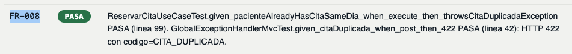
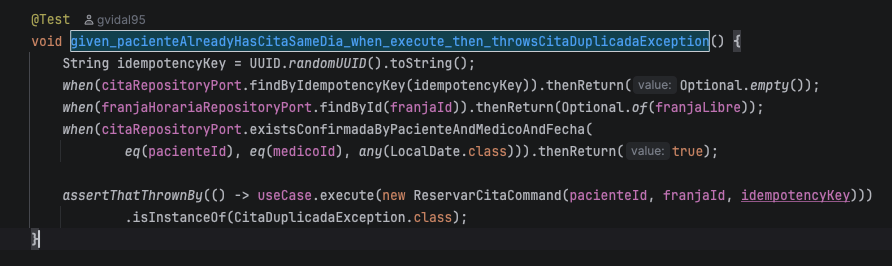
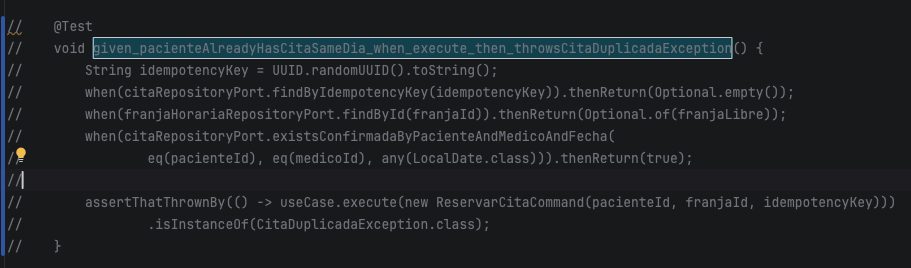
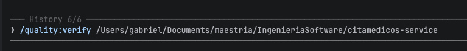
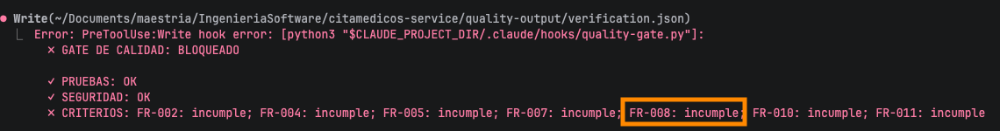
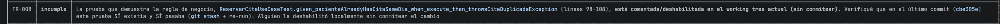
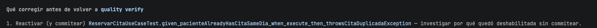
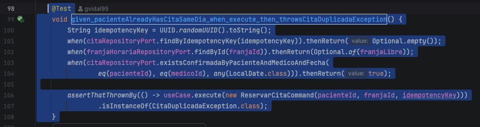
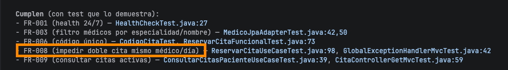

# Quality gate prueba de bloqueo 

## Prueba de bloqueo

Para realizar la prueba del Gate, se va a proceder a dejar FR-008 sin prueba. Esta prueba verifica que no se pueda reservar una cita si el paciente ya tiene una cita confirmada con el mismo médico el mismo día.

Se procede a comentar la prueba.

Ejecutar el comando /quality:verify

El Gate genera un bloqueo, FR-008 no cumple.

El agente muestra una explicación detallada del problema.

El agente muestra recomendaciones para solucionar el bloqueo.

## Prueba luego de corregir el archivo de pruebas

Se procede nuevamente a activar la prueba.

Ejecutar el comando /quality:verify

En los resultados el criterio el agente verifica que la prueba de FR-008 cumple.

